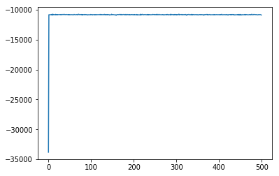
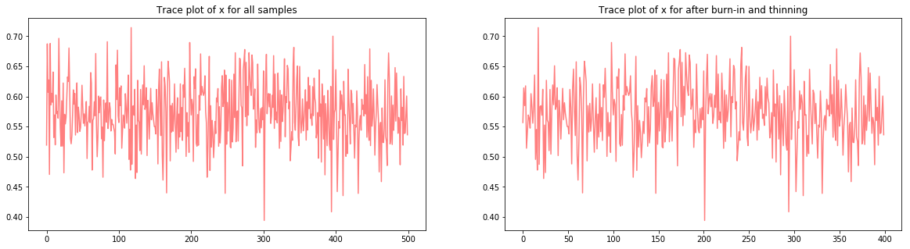
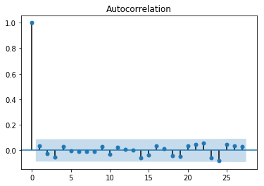
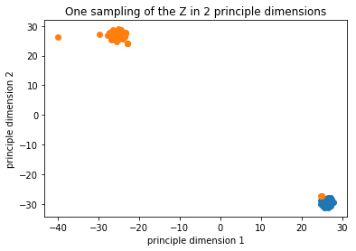

```python
import numpy as np
import scipy as sp
import scipy.stats as st
import matplotlib.pyplot as plt
import pandas as pd
```

# Homework 1

**Mert Ketenci**   
**mk4139**

## Problem 1

#### The Generative Process:

Pick $\theta \sim Dir(\alpha)$   
For $K \in [1,....c]$   
$\;\;\;$For $j \in [1,....m]$   
$\;\;\;\;\;\;\;\;\;\;\;\;$Draw component $P_{j,k} \sim Beta(a,b)$   
For each $ i \in [1,....n]$   
$\;\;\;$Draw belonging to party $Z_{i}|\theta \sim Cat(\theta)$   
$\;\;\;\;\;\;\;\;\;$For each $ j \in [1,....m]$   
$\;\;\;\;\;\;\;\;\;\;\;\;$Draw vote $X_{i}^{j}|Z_{i},P \sim Bernoulli(P_{j,k}|Z_{i})$

### Derivation of the Gibbs Sampling Distributions:

In this section, we will derive the equations of sampling distributions for Beta-Bernoulli mixture model one by one by marginalizing the denominator **with respect to variable of interest**. We will see the simplifications and how the denominator turns out being the normalization constant for each sampling distribution. We are going to write the **Likelihood** as open as possible to eliminate any potential vaugness.

#### The Likelihood:

$$P(\theta,P, Z,X) = P(\theta)\left(\prod_{k=1}^{c}\prod_{j=1}^{m}\frac{P_{j,k}^{\alpha-1}(1-P_{j,k})^{\beta-1}}{B(\alpha,\beta)}\right)\left(\prod_{i=1}^{n}\prod_{k=1}^{c}\theta_{k}^{I_{z_{i}=k}}\right)\left(\prod_{i=1}^{n}\prod_{j=1}^{m}\prod_{k=1}^{c}\left(P_{j,k}^{x_{i}^{j}}(1-P_{j,k})^{1-x_{i}^{j}}\right)^{I_{z_{i}=k}}\right)$$

The process can be described as:
1. Pick a distribution over the groups $\theta$ with respect to $Dirchlet$.
2. Pick probability of voting favor a bill for each group and for each bill from $Beta$.
3. Assign a group to every senator from $Categoical$.
4. Draw a vote for each bill given by each senator considering his/her group and bills probability from $Bernoulli$.

**The complete conditionals of the assignments.**

$$P(z_{i}|\theta,P,X,Z_{-i}) = \frac{P(\theta)\left(\prod_{k=1}^{c}\prod_{j=1}^{m}\frac{P_{j,k}^{\alpha-1}(1-P_{j,k})^{\beta-1}}{B(\alpha,\beta)}\right)\left(\prod_{i=1}^{n}\prod_{k=1}^{c}\theta_{k}^{I_{z_{i}=k}}\right)\left(\prod_{i=1}^{n}\prod_{j=1}^{m}\prod_{k=1}^{c}\left(P_{j,k}^{x_{i}^{j}}(1-P_{j,k})^{1-x_{i}^{j}}\right)^{I_{z_{i}=k}}\right)}{\sum_{z_{i}}P(\theta)\left(\prod_{k=1}^{c}\prod_{j=1}^{m}\frac{P_{j,k}^{\alpha-1}(1-P_{j,k})^{\beta-1}}{B(\alpha,\beta)}\right)\left(\prod_{i=1}^{n}\prod_{k=1}^{c}\theta_{k}^{I_{z_{i}=k}}\right)\left(\prod_{i=1}^{n}\prod_{j=1}^{m}\prod_{k=1}^{c}\left(P_{j,k}^{x_{i}^{j}}(1-P_{j,k})^{1-x_{i}^{j}}\right)^{I_{z_{i}=k}}\right)}$$

The terms that don't depend on $z_{i}$ are going to cancel.

$$P(z_{i}|\theta,P,X,Z_{-i}) = \frac{\prod_{i=1}^{n}\prod_{k=1}^{c}\theta_{k}^{I_{z_{i}=k}}\prod_{j=1}^{m}\left(P_{j,k}^{x_{i}^{j}}(1-P_{z_{i}})^{1-x_{i}^{j}}\right)^{I_{z_{i}=k}}}{\sum_{z_{i}}\prod_{i=1}^{n}\prod_{k=1}^{c}\theta_{k}^{I_{z_{i}=k}}\prod_{j=1}^{m}\left(P_{j,k}^{x_{i}^{j}}(1-P_{j,k})^{1-x_{i}^{j}}\right)^{I_{z_{i}=k}}}$$

From all the other things every thing except terms include $z_{i}$ will cancel since we have marginalized the denominator with respect to that.


$$P(z_{i}|\theta,P,X,Z_{-i}) \propto \prod_{k=1}^{c}\theta_{k}^{I_{z_{i}=k}}\prod_{j=1}^{m}\left(P_{j,k}^{x_{i}^{j}}(1-P_{j,k})^{1-x_{i}^{j}}\right)^{I_{z_{i}=k}}$$

$$P(z_{i}|\theta,P,X,Z_{-i}) \propto \theta_{z_{i}}\prod_{j=1}^{m}P_{j,z_{i}}^{x_{i}^{j}}(1-P_{j,z_{i}})^{(1-x_{i}^{j})}$$

**The complete conditional of the proportions.**

$$P(\theta|\beta,Z,X) = \frac{P(\theta)\left(\prod_{k=1}^{c}\prod_{j=1}^{m}\frac{P_{j,k}^{\alpha-1}(1-P_{j,k})^{\beta-1}}{B(\alpha,\beta)}\right)\left(\prod_{i=1}^{n}\prod_{k=1}^{c}\theta_{k}^{I_{z_{i}=k}}\right)\left(\prod_{i=1}^{n}\prod_{j=1}^{m}\prod_{k=1}^{c}\left(P_{j,k}^{x_{i}^{j}}(1-P_{j,k})^{1-x_{i}^{j}}\right)^{I_{z_{i}=k}}\right)}{\int_{\theta} P(\theta)\left(\prod_{k=1}^{c}\prod_{j=1}^{m}\frac{P_{j,k}^{\alpha-1}(1-P_{j,k})^{\beta-1}}{B(\alpha,\beta)}\right)\left(\prod_{i=1}^{n}\prod_{k=1}^{c}\theta_{k}^{I_{z_{i}=k}}\right)\left(\prod_{i=1}^{n}\prod_{j=1}^{m}\prod_{k=1}^{c}\left(P_{j,k}^{x_{i}^{j}}(1-P_{j,k})^{1-x_{i}^{j}}\right)^{I_{z_{i}=k}}\right)}$$

The terms that don't depend on $\theta$ are going to cancel.

$$P(\theta|\beta,Z,X) = \frac{P(\theta)\prod_{i=1}^{n}\prod_{k=1}^{c}\theta_{k}^{I_{z_{i}=k}}}{\int_{\theta}P(\theta)\prod_{i=1}^{n}\prod_{k=1}^{c}\theta_{k}^{I_{z_{i}=k}}}$$

$$P(\theta|\beta,Z,X) \propto P(\theta)\prod_{i=1}^{n}\prod_{k=1}^{c}\theta_{k}^{I_{z_{i}=k}}$$

$$P(\theta|\beta,Z,X) \propto \prod_{k=1}^{c}\theta_{k}^{a_{i}-1}\theta_{k}^{\sum_{i=1}^{n}\sum_{k=1}^{c}I_{z_{i}=k}}$$


$$P(\theta|\beta,Z,X) \propto \theta_{k}^{a_{k}-1+\sum_{i=1}^{n}\sum_{k=1}^{c}I_{z_{i}=k}}$$

$$P(\theta|\beta,Z,X) \sim Dir(a_{1}+n_{1},a_{2}+n_{2},a_{3}+n_{3},...a_{k}+n_{k})$$

**The complete conditional of the components.**

$$P(P_{j,k}|\theta,X,Z) = \frac{ P(\theta)\left(\prod_{k=1}^{c}\prod_{j=1}^{m}\frac{P_{j,k}^{\alpha-1}(1-P_{j,k})^{\beta-1}}{B(\alpha,\beta)}\right)\left(\prod_{i=1}^{n}\prod_{k=1}^{c}\theta_{k}^{I_{z_{i}=k}}\right)\left(\prod_{i=1}^{n}\prod_{j=1}^{m}\prod_{k=1}^{c}\left(P_{j,k}^{x_{i}^{j}}(1-P_{j,k})^{1-x_{i}^{j}}\right)^{I_{z_{i}=k}}\right)}{\int_{P_{k}} P(\theta)\left(\prod_{k=1}^{c}\prod_{j=1}^{m}\frac{P_{j,k}^{\alpha-1}(1-P_{j,k})^{\beta-1}}{B(\alpha,\beta)}\right)\left(\prod_{i=1}^{n}\prod_{k=1}^{c}\theta_{k}^{I_{z_{i}=k}}\right)\left(\prod_{i=1}^{n}\prod_{j=1}^{m}\prod_{k=1}^{c}\left(P_{j,k}^{x_{i}^{j}}(1-P_{j,k})^{1-x_{i}^{j}}\right)^{I_{z_{i}=k}}\right)}$$

Doin the same operations as above

$$P(P_{j,k}|\theta,X,Z) \propto P_{j,k}^{\alpha-1+\sum_{i=1}^{n}X_{i}^{j}I_{z_{i}=k}}(1-P_{k})^{\beta-1+\sum_{i=1}^{n}(1-X_{i}^{j})I_{z_{i}=k}}$$

$$P(P_{j,k}|\theta,X,Z) \sim Beta(\alpha+\sum_{i=1}^{n}X_{i}^{j}I_{z_{i}=k},\beta + \sum_{i=1}^{n}(1-X_{i}^{j})I_{z_{i}=k})$$

### How are we going to deal with missing values?

In the derived sampling expressions we see the terms that include $$\sum_{i}^{n}\sum_{j}^{m}X_{i}^{j}$$
This represents summation of votes with respect to bills and legistations. If a vote doesn't exist it will not participate to the likelihood. Thus, we will just ignore it. **A more correct notation** to represent this would be $$\sum_{i=1}^{n}\sum_{j\in votes_{i}}X_{i}^{j}$$ **Where $votes_{i}$ denotes the bills set senator i has voted**.


```python
x = pd.read_csv('votes.csv',header = None).values
```

### Initialization of the Varibles

In this section we are going to perform initialization to the variables of interest.


```python
class initialize_latent():
    def __init__(self,data,cluster_number):
        self.m = data.shape[1]
        self.k = cluster_number
        self.n = data.shape[0]
    def theta0(self):
        return np.ones(self.k)/self.k
    def p0(self):
        return np.ones((self.k,self.m))*0.5
    def z0(self):
        return np.random.randint(2, size=self.n)
```

### Implementation of Sampling

In this section we are going to implament the samplng distributions in Python.

#### The complete conditional of the assignments.

$$P(z_{i}|\theta,P,X,Z_{-i}) \propto \theta_{z_{i}}\prod_{j=1}^{m}P_{j,z_{i}}^{x_{i}^{j}}(1-P_{j,z_{i}})^{(1-x_{i}^{j})}$$


In theory, we should use all the previous values of $z_{i}$'s that are being generated. Yet, since $z_{i}$ are independent of each other given $\theta$, we are not going to sample sequentially.


```python
def z_sampler(x,z,theta,p):
    n = x.shape[0]
    c = theta.shape[0]
    log_theta = np.log(theta)
    log_likelihood = np.zeros((n,c))
    for i in range(n):
        for k in range(c):
            xi = x[i,:]
            log_likelihood[i,k] = np.sum(st.bernoulli.logpmf(xi[xi!=-1],p=p[k,:][xi!=-1]))+log_theta[k]
    dist_z = np.exp(log_likelihood - np.max(log_likelihood))
    dist_z = dist_z/np.sum(dist_z,axis=1).reshape(-1,1)
    z = []
    for i in range(n):
        z.append(np.random.choice(c,replace=True,p=dist_z[i,:]))
    return np.asarray(z)
```

#### The complete conditional of the components.

$$P(P_{j,k}|\theta,X,Z) \sim Beta(\alpha+\sum_{i=1}^{n}X_{i}^{j}I_{z_{i}=k},\beta + \sum_{i=1}^{n}(1-X_{i}^{j})I_{z_{i}=k})$$


```python
def p_sampler(x,z,global_variables):
    a = global_variables[0]
    b = global_variables[1]
    n = x.shape[0]
    m = x.shape[1]
    c = int(np.max(z)+1)
    p = np.zeros((c,m))
    for k in range(c):
        for j in range(m):
            xk = x[z==k]
            xkj = x[z==k][:,j]
            nkj = len(xkj[xkj!=-1])
            xkj[xkj==-1] = 0
            sumkj = np.sum(xkj)
            p[k,j] = st.beta.rvs(a+sumkj,b+nkj-sumkj)
    return p
```

#### The complete conditional of the proportions.

$$P(\theta|\beta,Z,X) \sim Dir(a_{1}+n_{1},a_{2}+n_{2},a_{3}+n_{3},...a_{k}+n_{k})$$


```python
def theta_sampler(z,alpha,c):
    parameters = np.zeros((c))
    for k in range(c):
        parameters[k] = z[z==k].shape[0]
    return st.dirichlet.rvs(parameters + alpha).flatten()
```

### Gibbs Sampler


```python
#If you change c also change alpha etc.
c = 2
alpha = np.array([0.5,0.5])
global_variables = np.array([0.5,0.5])

theta = initialize_latent(x,c).theta0()
p = initialize_latent(x,c).p0()
z = initialize_latent(x,c).z0()

likelihood = []
zs = []
thetas = []
ps = []
for i in range(500):
    z = z_sampler(x,z,theta,p)
    theta = theta_sampler(z,alpha,c)
    p = p_sampler(x,z,global_variables)
    #Caclulate log likelihood here
    log_dirchlet = np.sum(np.log(theta)*alpha)
    log_beta = np.sum(np.log(p)*(global_variables-1).reshape(-1,1) - np.log(sp.special.beta(global_variables[0],[1])))
    log_categorical = np.sum([np.log(theta[k]) for k in z])
    log_bernoulli = 0
    for i in range(x.shape[0]):
        xi = x[i,:]
        log_bernoulli += np.sum(st.bernoulli.logpmf(xi[xi!=-1],p=p[z[i],:][xi!=-1]))
    likelihood.append(log_dirchlet+log_beta+log_categorical+log_bernoulli)
    #Store values for auto correaltion
    zs.append(z)
    thetas.append(theta)
    ps.append(p)
```

The first problem asks us to plot the loglikelihood by iteration. First, we will plot the log likelihood. Then we will plot trace diagram for $\theta$. Afterwards, we are going to calculate the effective sample we have generated $n_{eff}$ to remove the correlation effect. At the end, we are going to visualize the seperation of our data to directly see if our sampler is successfull.

### Loglikelihood


```python
plt.plot(likelihood)
plt.show()
```





### Traceplot of $\theta$

We see a random white noise which is good. Means that $\theta$ is **currently** stable.


```python
S = np.asarray(thetas)[:,1]
burn_in = 100 #Asuuming first 100 samples are to be discarded
fig, ax = plt.subplots(1, 2, figsize=(20, 5))
ax[0].plot(range(S.shape[0]), S, color='red', alpha=0.5)
ax[0].set_title('Trace plot of x for all samples')
ax[1].plot(range(len(S[burn_in:])), S[burn_in:], color='red', alpha=0.5)
ax[1].set_title('Trace plot of x for after burn-in and thinning')
plt.show()
```





### Autocorrelation Plot of $\theta$

We see that the autocorrelation decreases significenlty after $2^{nd}$ lag. I am right now expecting a high $n_{eff}$.


```python
from statsmodels.graphics.tsaplots import plot_acf
plot_acf(S)
plt.show()
```





$$n_{eff} = \frac{n}{1 + 2\sum_{k=1}^\infty \rho(k)}$$


```python
autocorr = []
for lag in range(1,480):
    autocorr.append(pd.Series(S).autocorr(lag=lag))
```


```python
sum(autocorr)
```


    0.014637728244116827


```python
neff = 500/(1+2*sum(autocorr))
print("Our effective sample is",neff)
```

    Our effective sample is 485.7786094559575
    

Using the effective sample size, one can make aadditional calculations such as the Bayes estimate of the distrbiution. 

### Mapping to Two Dimensional Space 
#### t-SNE

In this section we are going to apply t-SNE to embade senators into two dimensional space, and visualize the result of our mixture model. **We see a clear seperation between two groups**. Thus, MCMC indeed works and has been able to sample true classes.


```python
>>> import numpy as np
>>> from sklearn.manifold import TSNE
>>> X_embedded = TSNE(n_components=2).fit_transform(x)
```


```python
for k in range(c):
    plt.plot(X_embedded[:,0][z==k],X_embedded[:,1][z==k],'o',label=str(k))

    
plt.title("One sampling of the Z in 2 principle dimensions")
plt.xlabel('principle dimension 1')
plt.ylabel('principle dimension 2')
plt.show()
```





## Problem 1

**a) Variables in the data**   

The data I am going to use comes from MovieLens Dataset and MPST: Movie Plot Synopses with Tags. MovieLens Dataset includes:   

- cast
- crew
- keywords
- budget
- genres
- belongs_to_collection (if movie comes from a series)
- imdb_id (primary key to connect MovieLens - MPST)
- popularity
- production_companies
- production_countries
- revenue
- original_title
- user rating

MPST Dataset includes:   

- imdb_id (primary key to connect MovieLens - MPST)
- plot_synopsis
- synopsis_source

Examples for where I expect dependency:

- genres and plot_synopsis
- popularity and belongs_to_collection
- popularity and revenue
- cast and genre
- budget and revenue
- belongs_to_collection and genre
- budget and genre
- keywords and plot_synopsis

Examples for where I expect conditional independencies:

- popularity, X  | revenue (given revenue, popularity is conditionally independent of anything else)
- genres, X | original_title (given the title genre is independent of anything else);

**b) Latent variables**   

The latent variables are going to be:

- Video vectors ($V_{j}$)
- User vectors  ($U_{i}$)
- Contents ($C_{j}$)

Assuming that the ratings are generated by the multiplication of those two vectors.

**Assumption:** 

1. Movie is a combination of contents. A video vector is a distribution over contents where each dimension spike happens when a movie contains that content. Thus, the distribution of movie vector is **Dirchlet.** 

**Ex:** Lord of the Rings: Adventure + Drama + Fantasy + ....   
**Ex:** Godfather: Gangster + Drama + Crime + Past/History + ....   
**Ex:** Star Wars: Science-fiction + Drama + Adventure + Fantasy + ....   

Given movie content distribution, we choose a topic that belongs to one of these contents and from that topic put a word into the plot. This is classical LDA assumption.


2. Another assumtion is that the dot product between movie flavour (content distribution) and user vector gives the rating.


**c) Research question**

**1.** Can we map movie contents to the ratings ? This will enable us to solve cold-start problem.   
**2.** Can we extract the building blogs of the movie such as    
    - Star Wars: Science-fiction + Drama + Adventure + Fantasy +...   
**3.** I am also thinking to develop model further to be able to make inference on given a movie which artist are likely to be in the crew. (Whixh artsit should be hired)   
